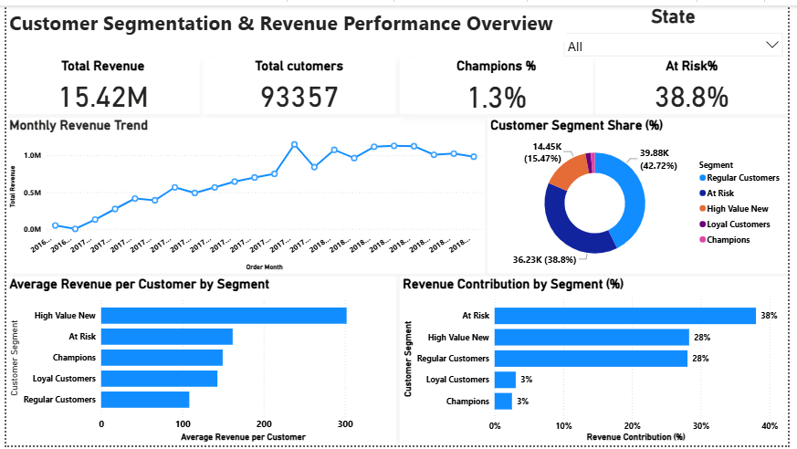
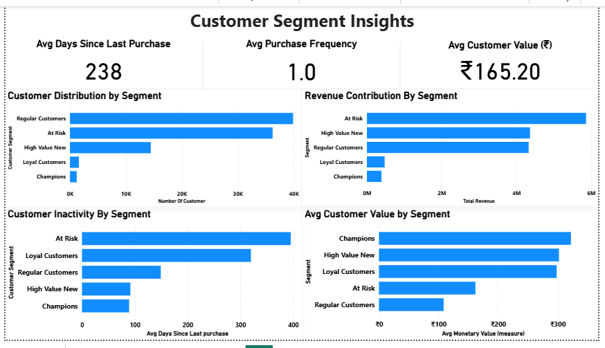

# Customer Lifetime Value (CLV) & Cohort Analytics

## Project Overview

This project analyzes customer purchasing behavior, retention patterns, and long-term revenue contribution using Customer Lifetime Value (CLV) and Cohort Analysis.

Using Python, SQL, and Power BI, customer, order, and payment data were integrated to evaluate customer value, identify repeat purchase behavior, and measure retention across acquisition cohorts.

---

## Business Problem

Acquiring customers is expensive, making retention and customer lifetime value critical for sustainable growth.

This analysis answers the following questions:

* Which customers generate the highest lifetime revenue?
* How much revenue does each customer contribute over time?
* What percentage of customers return after their first purchase?
* How do customer cohorts perform across subsequent months?
* Which customer groups create the greatest long-term business value?

---

## Dataset Overview

**Source:** Olist Brazilian E-Commerce Dataset

### Datasets Used

| Dataset   | Records |
| --------- | ------: |
| Customers |  99,441 |
| Orders    |  99,441 |
| Payments  | 103,886 |

### Analysis Period

**September 2016 – October 2018**

### Final Analytical Dataset

* Customer-level revenue aggregation
* Cohort-based retention analysis
* Valid transactions after data cleaning
* Customer lifetime value calculations

---

## Tools & Technologies

* Python
* Pandas
* NumPy
* SQL
* Power BI
* GitHub

---

## Key Skills Applied

* Customer Lifetime Value (CLV) Analysis
* Cohort Analysis
* Customer Retention Analytics
* Revenue Analytics
* Data Cleaning & Transformation
* SQL Querying
* KPI Development
* Dashboard Design
* Business Insight Generation

---

## Data Preparation

### Data Integration

The analysis was built by combining:

* Customers Dataset
* Orders Dataset
* Payments Dataset

### Join Logic

* Orders merged with Customers using **customer_id**
* Revenue aggregated at order level using **order_id**
* Customer performance measured using **customer_unique_id**

### Data Processing

* Validated data structure and quality
* Checked missing values
* Verified customer uniqueness
* Converted purchase dates to datetime format
* Removed zero-value transactions
* Created customer-level revenue metrics
* Generated cohort groups based on first purchase month

---

## Customer Lifetime Value Analysis

Customer-level metrics were calculated using:

* Total Revenue
* Total Orders
* First Purchase Date
* Last Purchase Date

The resulting CLV dataset enables identification of:

* High-value customers
* Repeat purchasers
* Revenue concentration patterns
* Long-term customer contribution

---

## Cohort Analysis

Customers were assigned to cohorts based on their first purchase month.

Retention performance was then tracked across future periods to evaluate:

* Customer retention
* Repeat purchase behavior
* Cohort decay patterns
* Long-term engagement trends

---

## Sample SQL Query

### Monthly Revenue Trend

```sql
SELECT
    DATE_FORMAT(order_purchase_timestamp,'%Y-%m') AS order_month,
    SUM(payment_value) AS revenue
FROM orders_final
GROUP BY order_month
ORDER BY order_month;
```

---

## Dashboard Preview

### Customer Lifetime Value Dashboard



### Cohort Retention Dashboard



---

## Key Business Insights

* Most customers completed only a single purchase, indicating limited repeat buying behavior.
* Customer retention declined significantly after the initial purchase period across most cohorts.
* A relatively small group of customers generated a disproportionately large share of total revenue.
* Customer acquisition increased substantially during 2017–2018, creating larger cohort sizes.
* Retained customers delivered significantly greater lifetime value than one-time purchasers.

---

## Business Recommendations

* Improve first-to-second purchase conversion through targeted retention campaigns.
* Develop loyalty programs for high-value customers.
* Focus marketing investment on customer segments with stronger repeat purchase behavior.
* Monitor cohort retention trends as a key business KPI.

---

## Project Files

* `README.md`
* `01_data_loading.ipynb`
* `customer_analysis.sql`
* `customer_lifetime_value_dashboard.pbix`
* `orders_final.csv`
* `rfm_customer_segments.csv`
* `clv_dashboard_overview.png`
* `cohort_retention_analysis.png`

---

## Skills Demonstrated

* Python Data Analysis
* SQL Analytics
* Power BI Dashboarding
* Customer Analytics
* Cohort Analysis
* Customer Lifetime Value (CLV)
* Data Visualization
* Business Intelligence
* Analytical Storytelling

